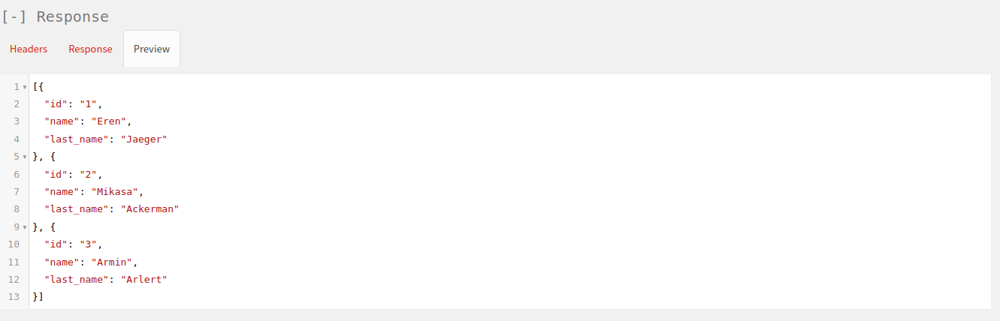
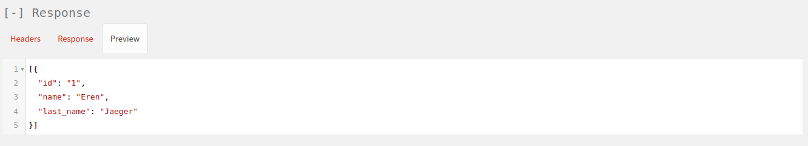
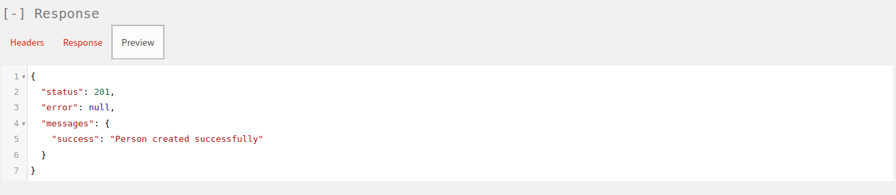
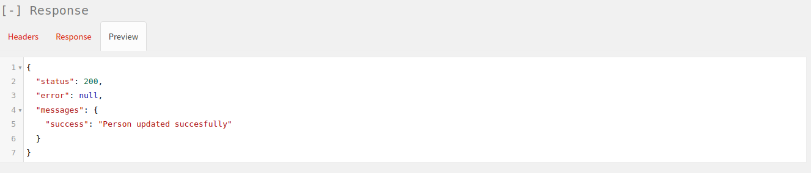
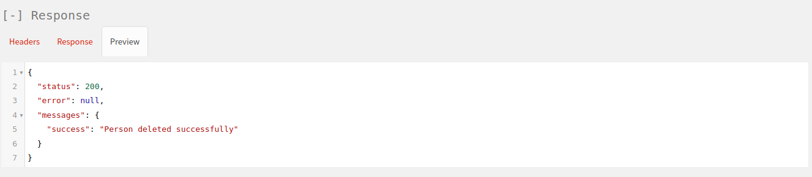

# CodeIgniter 4 REST API

## Demo - Screenshots
`GET http://localhost/person` 

`GET http://localhost/person/1` 

`POST http://localhost/person` 

`PUT http://localhost/person/1` 

`DELETE http://localhost/person/1` 

